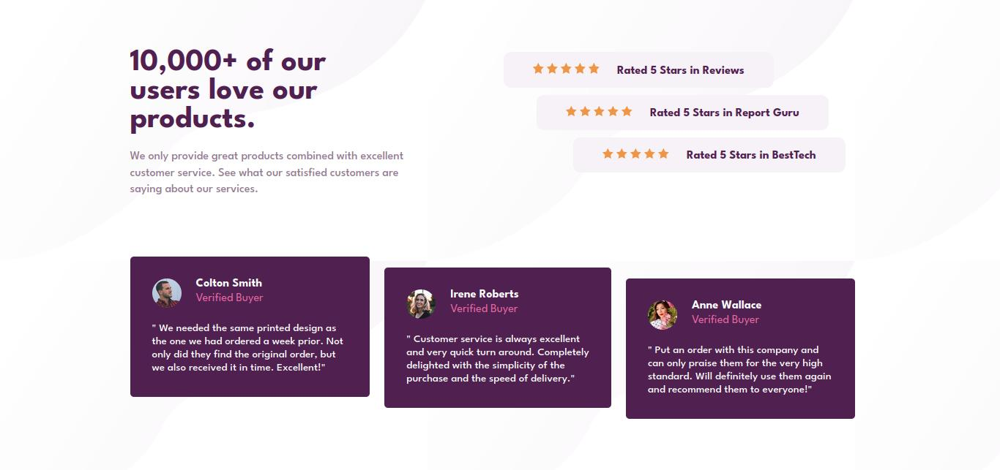

# Frontend Mentor - Social proof section solution

This is a solution to the [Social proof section challenge on Frontend Mentor](https://www.frontendmentor.io/challenges/social-proof-section-6e0qTv_bA). Frontend Mentor challenges help you improve your coding skills by building realistic projects. 

## Table of contents

- [Overview](#overview)
  - [The challenge](#the-challenge)
  - [Screenshot](#screenshot)
- [My process](#my-process)
  - [Built with](#built-with)
  - [What I learned](#what-i-learned)
  - [Continued development](#continued-development)

## Overview

### The challenge

This challenge was middle because is don't easy but also isn't hard so I am really fine about it.

### Screenshot

## My process

I start to do the HTML, after that I continue to the css file. I implement flexbox and grid because I see is more easy to use it.

### Built with

- Semantic HTML5 markup
- CSS custom properties
- Flexbox
- CSS Grid

### What I learned

I learned to implement better my HTML.

### Continued development

I will continued to development my skills about responsive design and knowledge of flexbox and grid.

